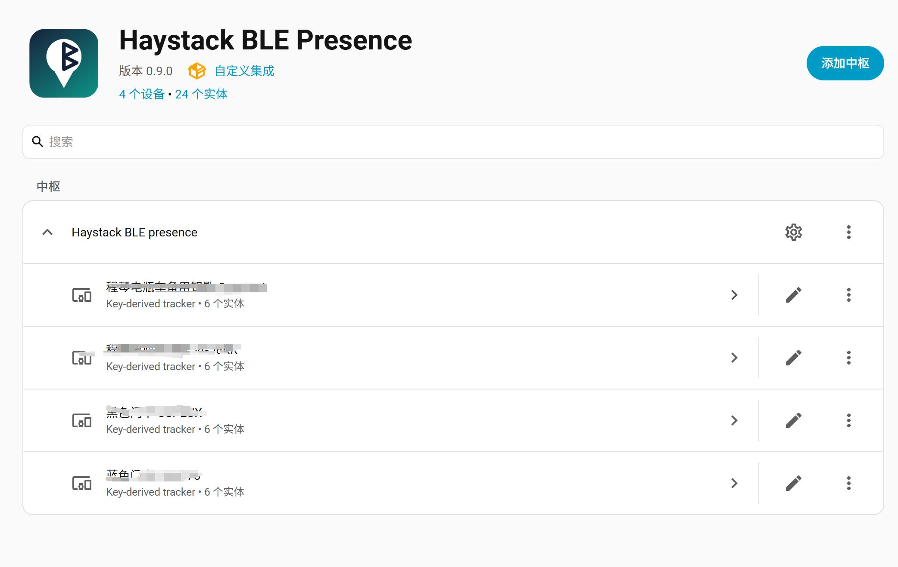
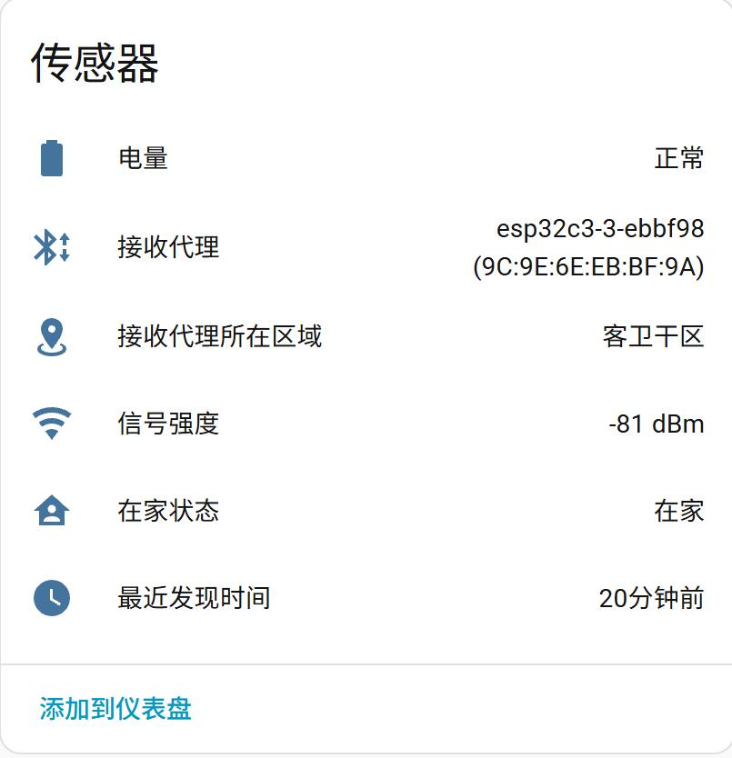

# Haystack BLE Presence

一个 Home Assistant 自定义集成，用于检测 **openhaystack 设备** 是否在家。

这类设备逆向自 Apple AirTag 的 FindMy 机制，内置若干密钥并**定时轮换密钥**，每次轮换都会改变自身广播的蓝牙 MAC 地址。本集成从设备对应的 JSON 密钥文件中离线派生出该设备所有可能的广播 MAC 地址，再用 ESPHome 蓝牙代理收到的广播去匹配：**只要广播地址命中该设备的任一 MAC，就认为设备在家**，并可显示是被哪个代理、哪个区域收到的，以及电量等状态。




---

## 功能

- **在线/离家检测**：基于 ESPHome 蓝牙代理收到的被动广播，匹配设备的轮换 MAC 集合。
- **按设备分组**：每个密钥文件里的 `id`(如 `IG5CW8`)对应一个 HA 设备，实体都归到该设备下。
- **显示接收代理**：显示最后一次收到广播的蓝牙代理名称。
- **显示代理区域**：显示接收代理在 HA 中所在的区域(需给代理设备分配区域)。
- **信号强度**：显示最后一次广播的 RSSI(dBm)。
- **最近发现时间**：最后一次收到广播的时间。
- **电量**：从广播中解析电量等级(正常/中等/低/极低)。
- **离线判定**：超过设定时间没收到广播则判为离家，并把“接收代理/信号强度/代理区域”置为未知。

---

## 环境要求

- Home Assistant **2023.12 或更高**。
- 已启用 **Bluetooth 集成**，并有可用的蓝牙扫描来源(蓝牙适配器、ESPHome 蓝牙代理)。
- 设备能覆盖到至少一个代理。

---

## 安装

1. 把整个 `haystack_ble_presence` 文件夹放到 HA 配置目录的 `custom_components/` 下：

   ```
   <config>/
   └── custom_components/
       └── haystack_ble_presence/
           ├── __init__.py
           ├── manifest.json
           ├── ...
   ```

2. 重启 Home Assistant（也可以做完下面一步再重启 HA）。

---

## 使用方法

### 1. 准备密钥目录和文件

默认目录为 `/config/haystack_keys`（添加集成时可以自己定义），**不存在会自动创建**。把每台设备的一个 JSON 密钥文件放进去即可。

密钥文件目录结构如下：
```
<config>/
└── haystack_keys/
    ├── IG5CW8_devices.json
    ├── CSXEUY_devices.json
    ├── ...
```

JSON 文件示例：

```json
{
  "id": "IG5CW8",
  "name": "IG5CW8",
  "privateKey": "LncxZ27/pRwcIXeu3a7GnhMIwcNm06eLxWxXIw==",
  "additionalKeys": [
    "4J5ogcGC/BRkawPVFzSZdgjWcFKxSl0xMTSqsg==",
    "..."
  ]
}
```

### 2. 添加集成

1. 设置 → 设备与服务 → **添加集成** → 搜索 **Haystack BLE Presence**。
2. 首次配置只需填写 **离线判定时间(秒)**，默认 `30`。密钥目录已默认 `/config/haystack_keys`，直接提交即可。
3. 如需修改目录，添加后进入该集成的 **选项(Options)**，可编辑：
   - **密钥文件目录**：每行一个路径，可多个；
   - **离线判定时间(秒)**：设备多久没广播就判为离家，默认 `30`。
   保存选项时会重新读取密钥文件。

### 3. 给蓝牙代理分配区域(可选，用于“代理区域”)

在 设置 → 设备与服务 → 找到对应的 **ESPHome 代理设备** → 分配到某个 **区域(Area)**。之后设备的“接收代理所在区域”传感器就会显示该区域名称。

### 4. 查看实体

每个设备(`id`)下会生成以下实体：

| 实体 | 说明 |
|---|---|
| **在家状态** (`binary_sensor`) | `在家` / `离家` |
| **最近发现时间** (`sensor`) | 最后一次收到广播的时间 |
| **信号强度** (`sensor`) | 最后一次广播的 RSSI(dBm) |
| **接收代理** (`sensor`) | 最后一次收到广播的代理设备名称 |
| **接收代理所在区域** (`sensor`) | 该代理在 HA 中的区域 |
| **电量** (`sensor`) | 正常 / 中等 / 低 / 极低 |

### 5. 手动重扫(可选)

当设备更新了密钥(新增/更换 JSON 文件)后，无需重启，可在该集成上点 **重新加载**。

---

## 常见问题

**一直显示“离家”**

- 确认密钥目录与文件正确。
- 确认设备确实在某个蓝牙代理覆盖范围内，且代理在线。

**“接收代理所在区域”为空**

- 需要先在 HA 里给对应的 ESPHome 代理设备分配一个区域。

---

## 备注

- 本集成仅在本地运行，不上传任何密钥或数据。
- 匹配机制完全基于广播的内容，不会连接设备、不读取其内容。
- 密钥文件属于敏感信息，请妥善保管。
